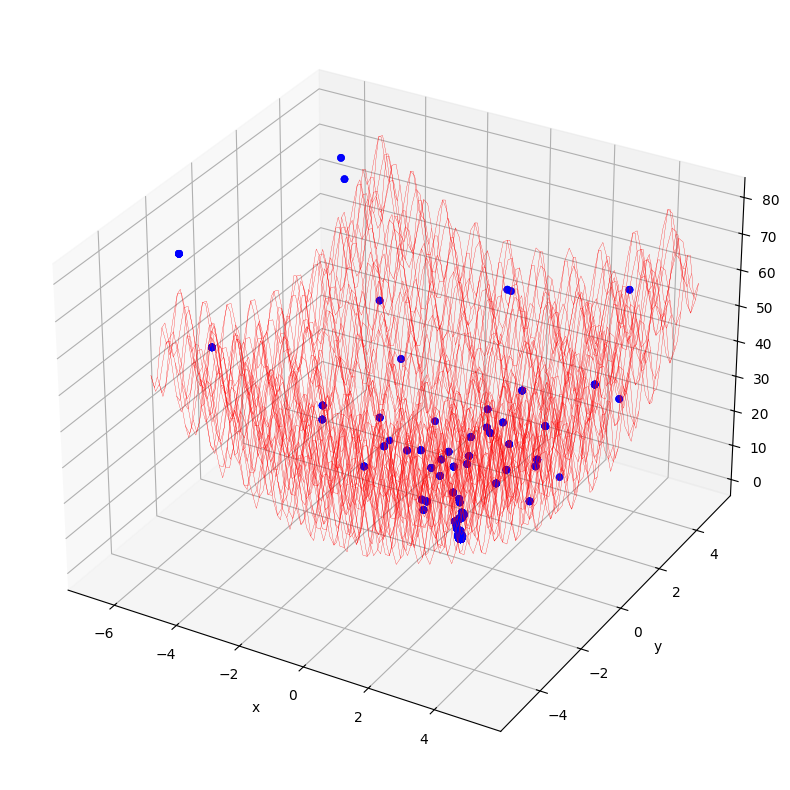

# Aplicación del Algoritmo Particle Swarm Optimization (PSO)

**Repositorio para la implementación y análisis del algoritmo de optimización por enjambre de partículas (PSO), aplicado a la búsqueda de mínimos locales en funciones matemáticas no lineales.**

---

## 🧠 Descripción General

El algoritmo **Particle Swarm Optimization (PSO)** es una técnica de optimización basada en inteligencia colectiva, inspirada en el comportamiento social de animales como bandadas de aves o cardúmenes de peces. Fue propuesto originalmente por Kennedy y Eberhart en 1995 y ha sido ampliamente utilizado en problemas de optimización numérica debido a su simplicidad y eficacia.

Este repositorio contiene una implementación desde cero de PSO en Python, aplicada a funciones con múltiples óptimos locales, con el objetivo de encontrar los **mínimos locales o globales** mediante exploración eficiente del espacio de búsqueda.

---

## 📌 ¿Cómo Funciona PSO?

Cada solución potencial (llamada **partícula**) se mueve por el espacio de búsqueda siguiendo dos vectores principales:

- **Memoria personal (`pbest`)**: el mejor punto encontrado por la partícula hasta el momento.
- **Memoria global (`gbest`)**: el mejor punto encontrado por toda la población de partículas.

### Fórmulas:

El algoritmo actualiza la velocidad `v` y la posición `x` de cada partícula de acuerdo con:

$v_{i}(t+1) = w \cdot v_{i}(t) + c_1 \cdot r_1 \cdot (pbest_i - x_i(t)) + c_2 \cdot r_2 \cdot (gbest - x_i(t))$

Donde:
- `w` es el coeficiente de inercia.
- `c1` y `c2` son los coeficientes de aceleración cognitiva y social.
- `r1`, `r2` son números aleatorios en [0, 1].

---

## 📈 Aplicación a Funciones Matemáticas

Este proyecto se centra en probar PSO en funciones con múltiples mínimos, como:

- **Rastrigin**
- **Ackley**
- **Sphere**
- **Himmelblau**

Cada una de estas funciones presenta desafíos distintos para el algoritmo, desde múltiples óptimos locales hasta topologías de difícil convergencia.

---

## 🏆 Resultados
